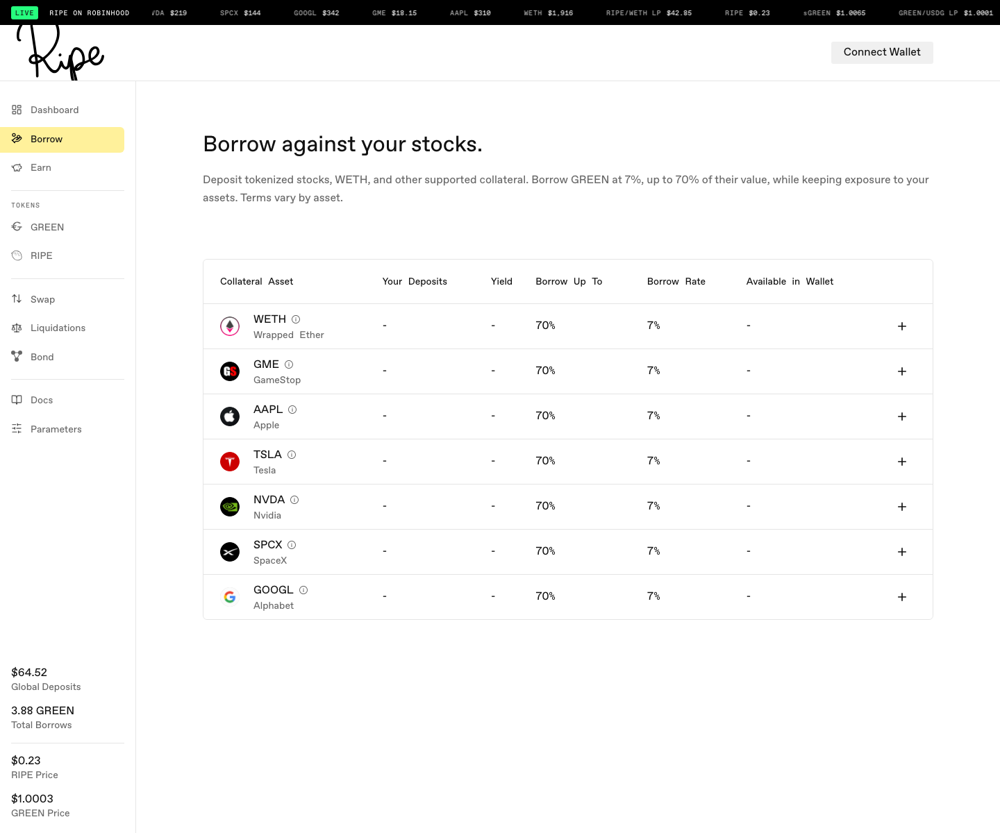
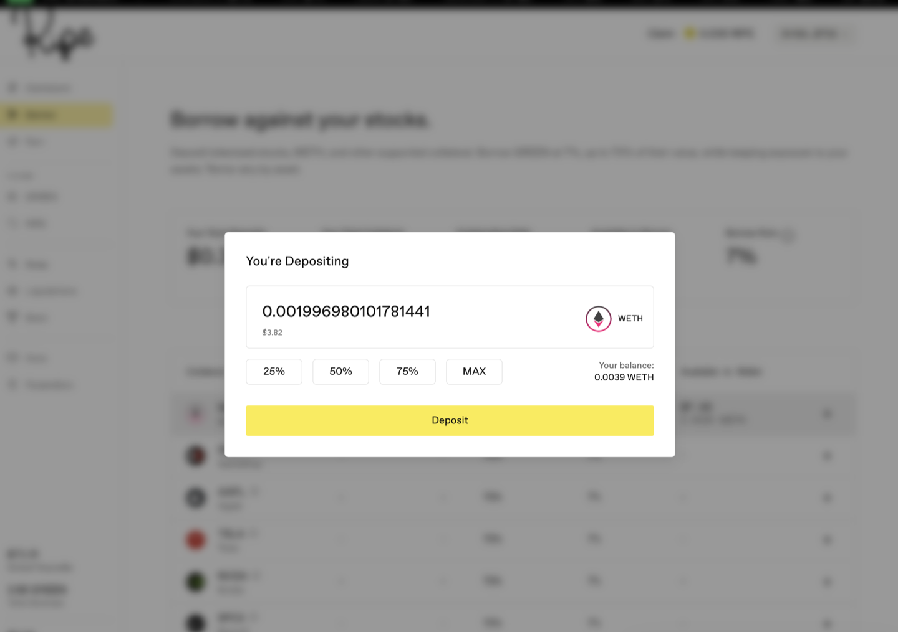
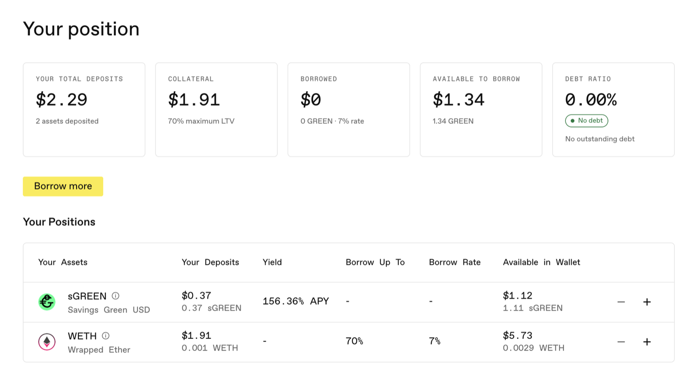

# Deposit Stock Tokens

Anything you deposit on the Borrow page becomes [collateral](../core-protocol/03-collateral-assets.md) for one loan. Stock tokens, WETH, and whatever else your network supports all go into the same position.

**Step 1.** Go to [app.ripe.finance](https://app.ripe.finance), pick your network, and press **Connect Wallet** (top right).

**Step 2.** Open the **Borrow** page from the left menu. It lists every asset you can deposit on that network, with each one's terms in the table.

**Step 3.** Find the asset you hold and press **+** on its row. Your wallet balance shows in the **Available in Wallet** column.

**Step 4.** Enter the amount. The first time you deposit a token, your wallet asks you to **Approve** it — a permission for the amount you're depositing. Approve, then confirm the deposit. A later, larger deposit may ask for approval again.

**Step 5.** Done. Your deposit shows in the **Your Deposits** column, and the panel at the top of the page updates with your totals.

One thing you'll notice: **Your Total Deposits** and **Your Total Collateral** can differ. Only assets with borrowing power (a nonzero LTV) raise what you can borrow. Earn-side positions like sGREEN, LP tokens, and RIPE don't. Your sGREEN and GREEN LP in the Stability Pool aren't walled off from your loan, though: they're what [deleverage](../core-protocol/05-deleverage.md) spends first if your position needs saving. Locked RIPE is left alone. The Borrow table is the live answer for which assets count.

Deposit as many supported assets as you like. Each one with borrowing power adds to a [single loan](../core-protocol/02-borrowing.md), and stock tokens keep their full upside while they sit there — see [Stock Tokens on Ripe](../core-protocol/00-stock-tokens.md).

Next: [Borrow GREEN](03-borrow-green.md).
