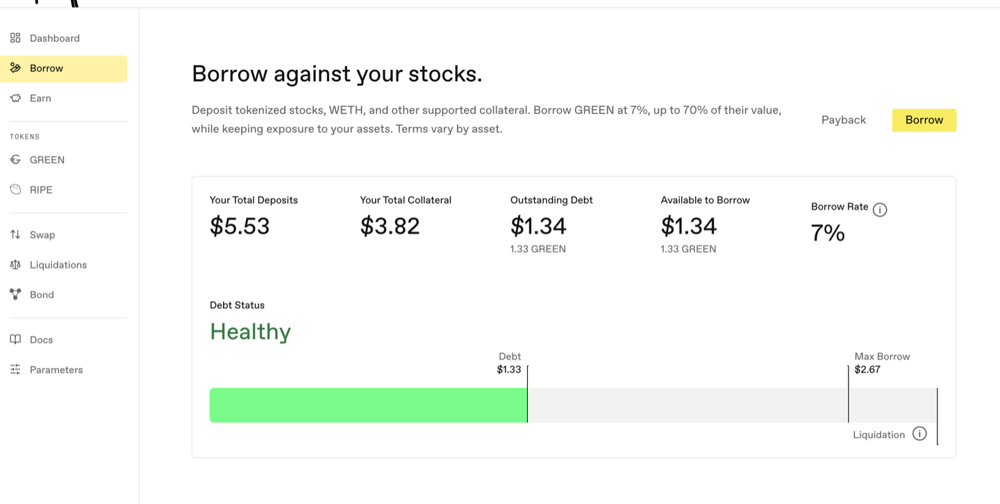

# Borrow GREEN Against Stock Tokens and Your Portfolio

A supported Robinhood Stock Token — called a **Stock Token** below — can back the [GREEN](../core-protocol/01-green-stablecoin.md) you borrow alongside other eligible collateral. The app shows each asset's current terms and your position's numbers before you confirm anything.

**Step 1.** With collateral deposited, stay on the **Borrow** page. The panel at the top shows your position: Your Total Deposits, Your Total Collateral, Outstanding Debt, Available to Borrow, and the Borrow Rate.

**Step 2.** Press **Borrow** (top right of that panel).

**Step 3.** Enter the amount. Borrow comfortably less than the maximum. Prices move, and borrowing less keeps your position healthier when they do. The bar shows your debt against the Max Borrow and Liquidation markers as you type.

**The last published Stock Token price may remain usable after the reference market closes** while it satisfies the configured freshness rules. A fresh reopening price can gap from the prior close, so borrow comfortably below the maximum. See [Stock-Market Hours and Price Gaps](../core-protocol/06-price-oracles.md#stock-market-hours-and-price-gaps) for the canonical explanation.

**Step 4.** Choose what you receive and where it goes. This is easy to miss and it matters:

* **Receive Token:** **GREEN** (the plain stablecoin) or **Savings GREEN** ([sGREEN](../earning-and-rewards/01-sgreen.md), whose backing per share can increase through configured protocol revenue).
* **Destination:** **Wallet** or **Stability Pool**. The Stability choice applies only to Savings GREEN: the borrow flow first wraps GREEN into sGREEN, then deposits that sGREEN into the configured preferred [Stability vault](../earning-and-rewards/02-stability-pools.md).

If you choose plain GREEN, it goes to your wallet even if the Stability flag is set. If you choose Savings GREEN and Stability, only an amount above the wrapping floor is wrapped and deposited; an amount at or below that floor remains GREEN in your wallet.

**Step 5.** Press **Borrow** and confirm in your wallet.

**What to watch afterward:** your Debt Status on the Borrow page (and Debt Ratio on the Dashboard). It reads **No Debt** before you borrow and **Healthy** while you have comfortable room, with your debt shown against the Max Borrow and Liquidation markers. If your collateral loses enough value, your position can be [liquidated](../core-protocol/04-liquidations.md).

The Dashboard shows the same position as a **Debt Ratio** card, which spells out how the number is calculated and the ratio at which liquidation happens. Same information, two vocabularies: the Borrow page gives you a word, the Dashboard gives you the percentage behind it.

Next: [Pay back and withdraw](04-pay-back-and-withdraw.md).
