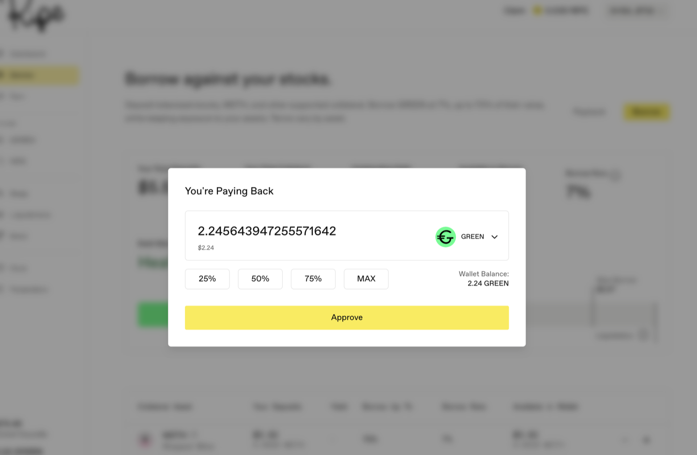
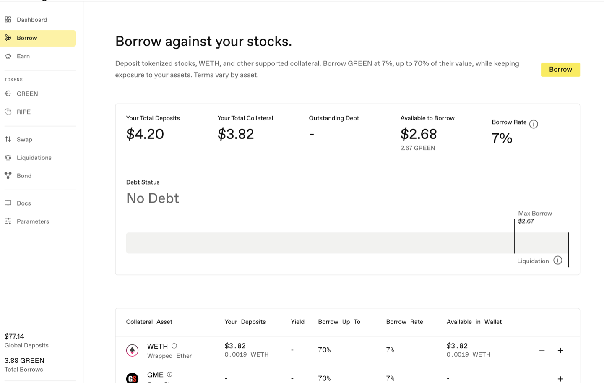

# Pay Back and Withdraw

**Step 1.** Go to the **Borrow** page and press **Payback** (next to the Borrow button). It only appears once you have outstanding debt; with none, the panel simply reads No Debt. The Dashboard offers the same action under the name **Repay**. Same thing, either works.

**Step 2.** Enter how much GREEN to pay back, part or all. The MAX button fills in the full balance of whatever you're paying with.

You don't have to pay from your wallet, and the dialog may offer eligible deposited assets in addition to GREEN. A direct GREEN or [sGREEN](../earning-and-rewards/01-sgreen.md) repayment burns GREEN against your debt. When you select a configured GREEN-pair LP position—GREEN/USDG LP in the captured example—the app uses the separate deleverage route: it consumes that deposited collateral and credits the value actually processed against your debt. The **Source** toggle can use eligible value deposited in the [Stability Pool](../earning-and-rewards/02-stability-pools.md). This is why an LP payback is not the same contract action as an ordinary GREEN repayment, even though the app presents both in one dialog.

The button reads **Approve** the first time, not Payback. That's the one-time permission for the token you're paying with; approve it in your wallet and the button becomes Payback. Your debt ratio improves as soon as the payment lands.

**Step 3.** To take collateral out, use the **-** control on the asset's row in the collateral table (the **+** deposits, the **-** withdraws). You can withdraw value not needed to cover your remaining debt, subject to vault custody and the ordinary token, pause, quarantine, and action-block checks. Full repayment removes the debt-health constraint, but those other controls still apply.

**Step 4.** Confirm in your wallet, then check your wallet balance.

Next: [Get GREEN and provide liquidity](05-provide-liquidity.md).
