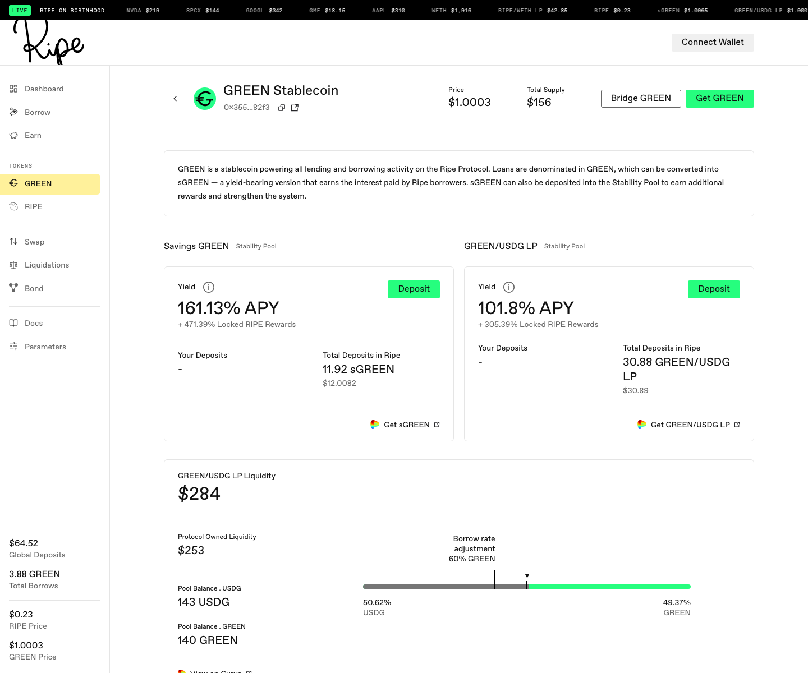
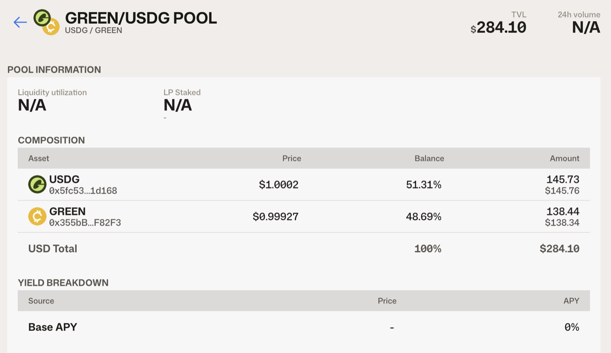
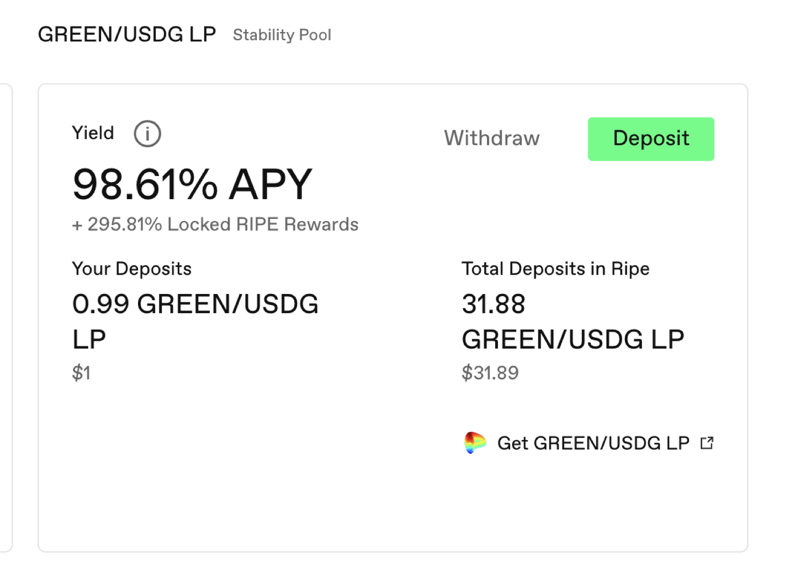

# Get GREEN and Provide Liquidity

This walkthrough uses the GREEN/USDG Curve pool shown in the captured interface as an example. Current pairs, venues, Stability eligibility, and reward configuration can differ by network and over time; check the interface and [RIPE Params](https://params.ripe.finance) for the current configuration.

A configured GREEN-pair AMM pool, its LP token, and Ripe's [Stability vault](../earning-and-rewards/02-stability-pools.md) are related but different. You provide liquidity to the external AMM to receive its LP token. If that LP token is accepted by a Stability vault, depositing it can participate in liquidation settlement and can earn [RIPE rewards](../earning-and-rewards/03-ripe-rewards.md) when configured.

**Step 1.** Get GREEN. Two ways: [borrow it](03-borrow-green.md), or press **Get GREEN** on the GREEN page and swap for it.

**Step 2.** In this example, get USDG by swapping for it on a DEX or bringing it across the bridge.

**Step 3.** Turn what you hold into the example LP token. The captured interface shows two routes:

* The quick route: press **Get GREEN** and set the swap's To asset to **GREEN/USDG LP**. One swap takes you from USDG straight to the LP token, both sides of the pool handled for you.
* The manual route: press **Get GREEN/USDG LP**. This takes you to the pool on Curve, outside the Ripe app. Add your GREEN and USDG there yourself; entering with only one side works but costs slippage, so bring both.

Either way you end up with LP tokens in your wallet representing your share of the pool.

**Step 4.** This is the step people miss: come back to Ripe, go to the **Earn** page, find the configured LP row—GREEN/USDG LP in this example—and press **Deposit**. LP tokens in your wallet still represent the external AMM position, but they do not earn Ripe rewards merely by being held there. An eligible deposited LP position can be consumed as Stability liquidity in exchange for claimable liquidation collateral and can earn RIPE when configured.

Once deposited, the card shows your position, the yield, and the RIPE rewards on top. As liquidations occur, part of the vault's LP liquidity can become claimable collateral. Claimable NAV is not the same as immediately withdrawable LP-token liquidity.

A shortcut worth knowing: if you're borrowing anyway, choose Savings GREEN and—when a compatible Stability destination is configured—the borrow flow can convert the new GREEN to sGREEN and deposit it without a wallet round-trip.

If that deposit box shows "Your balance: -", it means you don't hold the token yet. Go back and do Step 3 first.

**Step 5.** When this position is configured for RIPE rewards, its entitlement accrues and appears on your dashboard. Claiming runs through the [claim dialog described in the next guide](06-get-and-lock-ripe.md#how-claiming-rewards-applies-a-lock). The configured auto-stake portion receives a reward lock, and **Stake All** can deposit the full claim. Read that section before you claim for the first time.

A note on the yield numbers you'll see: displayed rates are estimates, not guarantees. They can move with underlying asset returns, reward configuration, deposits, claim-asset values, and available liquidity.

Next: [Get RIPE and lock it](06-get-and-lock-ripe.md).
