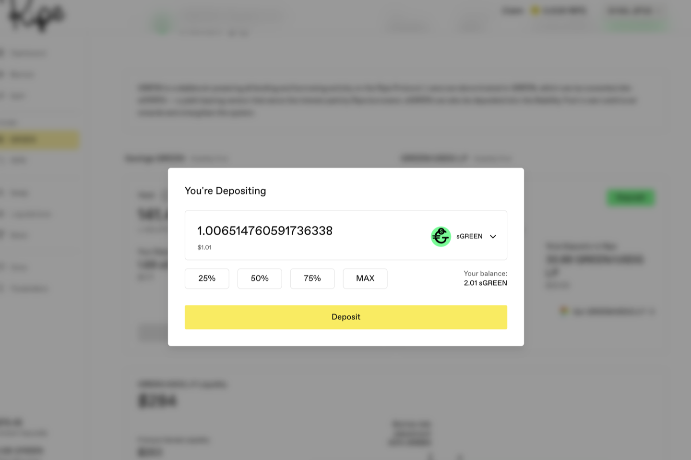
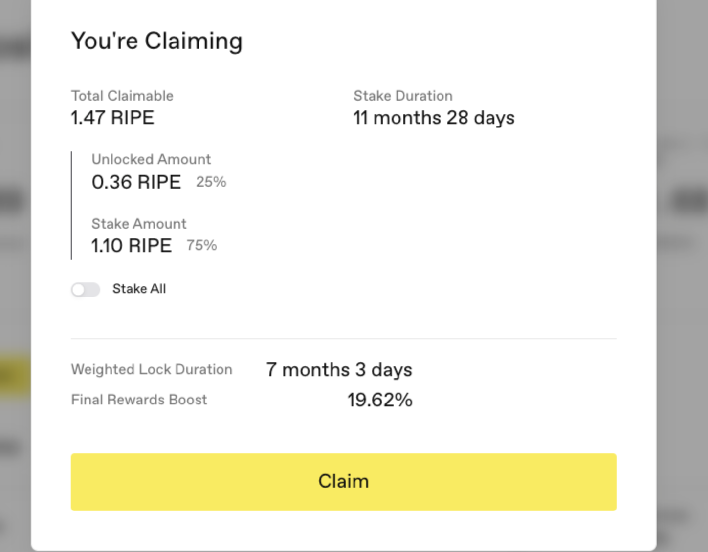

# Get RIPE and Lock It

RIPE is the protocol's token. A configured lock can raise the rate at which a governance-vault position accumulates points and rewards. A compatible [governance](../governance-and-economics/02-governance.md) interface can use those points as voting weight; the lock itself does not authorize protocol administration.

**Step 1.** Get RIPE: press **Get RIPE** on the RIPE page to swap for it, or use **Bridge RIPE** where the live interface offers that route.

Ripe also has two separate protocol distribution mechanisms. [Ripe Bonds](../governance-and-economics/03-bonds.md) exchange an accepted payment for an immediate or governance-vault RIPE payout under BondRoom terms. The [RIPE Reserve Engine](../governance-and-economics/04-reserve-engine.md) collects an accepted payment when a vesting position is created and mints RIPE only as it is claimed. Their availability and inputs are configuration, not assumptions of this walkthrough.

Where RIPE rewards come from, so you know what you're joining: a configured reward accounting allowance accrues according to elapsed protocol blocks and is divided among configured participant and asset allocations. Ordinary participant RIPE is minted when a claim consumes entitlement, subject to mint authorization and the protocol circuit breaker; the same allowance can also fund separately authorized distribution paths. The RIPE page shows the estimates, claim split, and eligible positions exposed by the interface; [RIPE Params](https://params.ripe.finance) shows current onchain reward settings. The [RIPE Rewards guide](../earning-and-rewards/03-ripe-rewards.md) explains how those rewards and separate paths work.

Common governance-vault position types include RIPE itself and a configured RIPE-pair LP token. The captured interface shows RIPE/WETH LP through Uniswap V2 as an example; available assets and venues can change. An LP route carries the usual liquidity-provider tradeoff: its token mix changes as pool prices move. Either position earns RIPE rewards only when configured, and the claiming rules below apply to those rewards.

**Step 2.** Go to the **RIPE** page (or the **Earn** page), find the RIPE row, and press **Deposit**.

**Step 3.** Enter an amount using the 25% / 50% / 75% / MAX buttons or by typing it.

**Step 4.** Choose your deposit lock duration. You can later request an explicit extension, but not a shortening. The duration attached to auto-staked rewards is derived from protocol configuration rather than chosen in the claim dialog.

Worth understanding before you pick: your RIPE asset position in that governance vault carries a **single blended lock duration**, not one per deposit. The vault converts each deposit into shares and blends the old and new remaining durations using their exact share weights. Deposit a large share amount at a short lock and the blended duration across that position can come down. Deposit at a long lock and it can go up. The resulting boost and unlock apply to that complete asset position in the vault, not just the new deposit. A position left in a historical governance vault remains separate if Mission Control later selects a new core vault.

**Step 5.** Press **Deposit** and confirm in your wallet. Your position and its rewards appear on the page.

## How Claiming Rewards Applies a Lock

This is the part of Ripe most likely to catch you out, so read it before you claim anything.

Open the claim dialog and it shows an **Unlocked Amount** that goes to your wallet and a **Stake Amount** deposited into the core governance vault currently configured in Mission Control. With **Stake All** off, their split follows the protocol's configured auto-stake ratio. If that ratio is nonzero, you cannot reduce the staked amount below it; read the two live amounts instead of assuming a previous split still applies.

The **Stake All** toggle only shifts the ratio further. Leave it off and you receive the configured liquid remainder. Turn it on and everything is staked, with nothing reaching your wallet. If the configured auto-stake ratio is zero, a normal claim can be fully liquid.

Then the part people don't expect:

**Staking a reward applies a lock to your RIPE asset position in the current core vault, not only the rewards being staked.** The dialog shows this as **Weighted Lock Duration**, blending the existing shares in that position and the newly staked reward shares into one lock covering all of it. It does not merge a separate position in a historical governance vault. The values in the screenshot are an illustrative example; the reward lock, resulting weighted duration, and boost come from the live configuration and position.

Whenever a claim stakes a nonzero amount, it recalculates the lock across that RIPE asset position in the current core vault.

**Read these four numbers before pressing Claim:**

* **Unlocked Amount**: what actually reaches your wallet.
* **Stake Amount**: what gets staked instead.
* **Weighted Lock Duration**: how long your whole position is committed once you confirm.
* **Final Rewards Boost**: the estimated point-rate effect under the displayed terms.

## Leaving a Lock Early Has a Cost

If early release is enabled for the position and its configured exit fee is nonzero, the vault applies that fee through its share accounting. A zero fee disables early release rather than making it free. Releasing the lock does not withdraw the remaining assets: withdrawal is a separate action, another holder of the same governance asset must remain in that vault, and a bad-debt freeze can block release. The [governance guide](../governance-and-economics/02-governance.md#early-exit-the-nuclear-option) explains the full mechanism.

That cost is the reason to take the lock duration seriously at deposit and check the Weighted Lock Duration before every claim. If there is a chance you will want the RIPE before the displayed unlock, hold it in your wallet unlocked and skip the boost.

Next: [See everything you can deposit on Earn](07-what-you-can-deposit-on-earn.md).
